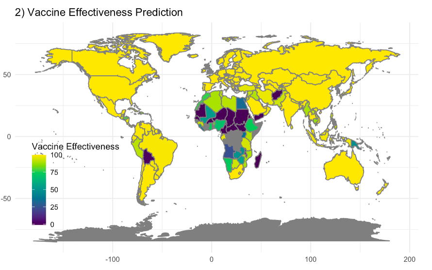

# Rotavirus vaccine efficacy and effectiveness estimation using machine learning methods

## Background
Rotavirus is the leading cause of diarrheal diseases worldwide and is responsible for substantial morbidity and mortality among children younger than 5 years of age. The introduction of rotavirus vaccines into national immunization programs has greatly reduced hospital admissions and deaths from rotavirus gastroenteritis, but vaccine efficacy and effectiveness vary substantially between high- and low-income settings. Given the disparity of vaccine performance across countries, we built a model to predict how well the vaccines would work in settings without vaccine introduction.

## Methods

**1. Study inclusion and selection process**

We included 29 studies in the RCTs meta-analysis, 45 studies in the case-controls metaanalysis, and 74 studies in the combined metaanalysis.

**2. Meta-analysis**

 We applied inverse variance weighted method for both a fixed-effect model and a random effects model. The overall RR and OR were calculated using the Mantel-Haenszel method, and the heterogeneity between studies was evaluated by I². We further conducted subgroup analysis to investigate heterogeneity in our included studies.

Fig2. Forest plot of relative risk estimates from RCTs of rotavirus vaccine efficacy

## Result
**1. Meta-regression**

A regression model was developed and fitted at study level. We explored how much heterogeneity in VE could be explained by the predictor variables and looked at their interactions.

**2. Predictor selection and cross validation**

We implemented several predictor selection methods: step-wise selection based on Akaike information criteria (AIC), Least Absolute Shrinkage and Selection Operator (Lasso) regression, spike-andslab regression, and random forest. We also cross validated different predictive models.

Selected predictor variables with different methods

**3.Posterior model based vaccine prediction**

We used our final model at the country level, with prevalence of diarrhea in children under 5, GDP, and study indicator as predictors, for our prediction step. We then built a country-level generalized linear regression model.

  
   

**Fig3. Model-based vaccine prediction**

Plot 1) shows the model estimated vaccine efficacy globally; similarly, plot 2) shows the vaccine effectiveness estimates. The negative prediction number is showed as 0 in the plot.

## Conclusion
In conclusion, we built a model based on the most important predictors for vaccine efficacy and vaccine effectiveness evaluation. Since the value of each predictor variable from different countries can be obtained from publicly available databases, this model can thus be used to estimate the vaccine performance in countries without vaccine implementation and to evaluate how much benefit a vaccine program could add to the current scenario.

